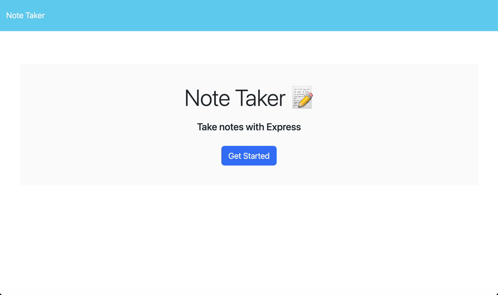
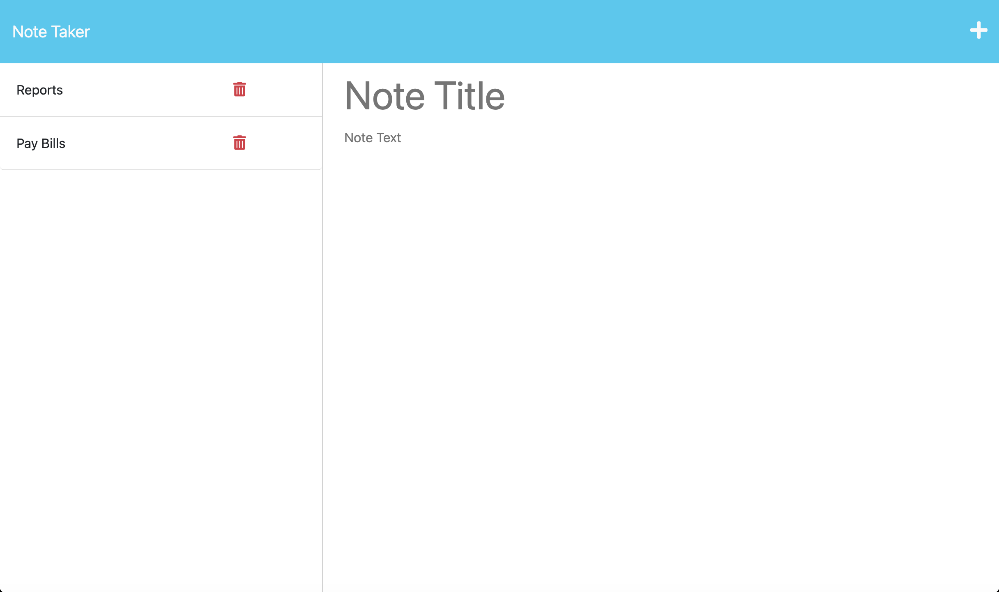

# Note Taker
  

  ## Description
  
  Use simple web UI for Note Taking

  ## Table of Contents
  * [Installation](#installation)
  * [Usage](#usage)
  * [License](#license)
  * [Contribute](#contribute)
  * [Testing](#testing)
  * [Questions](#questions)
  
  ## Installation
  You will need to install the following to use this project

  `express` and `uuid`

  ## Usage

  The use case for this project is To take notes quickly using a web app that has a simple interface.

  You can try the app out for yourself [here](https://notesap-8ea33a991893.herokuapp.com/)
  
  

  ## License

  This Project is licensed under [MIT](https://opensource.org/licenses/MIT)

  ## Contribute

  If you would like the help contribute to this project use the Github Repo

  ## Testing

  To test this project do the following,

  clone repo, install packages, then run CLI command `node sever.js`

  ## Questions
  
  For any questions related to this project contact [Linkedin](https://www.linkedin.com/in/greg-stevenson-422931a9/) or [Github](https://github.com/Olegreg762) 
  You can see more of my work on my Github [Olegreg762](https://github.com/Olegreg762)
